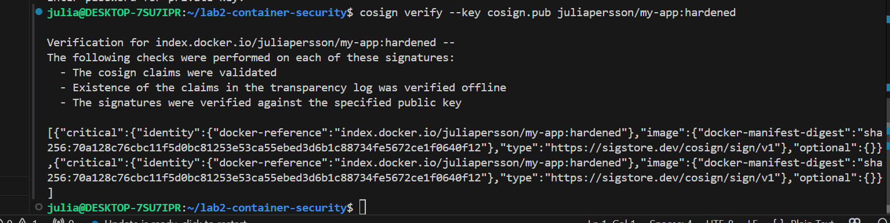

# Lab2 Container Security

## Vad projektet gör
I den här labben har jag jobbat med container-säkerhet. Jag byggde först en
medvetet osäker Docker-image för att se hur många sårbarheter den innehöll,
och sedan härdade jag den för att minska riskerna. Jag använde Trivy för att
skanna imagesen, skapade en SBOM för att dokumentera vad som finns i imagen,
och testade säkerhetspolicies i Kubernetes med OPA Gatekeeper.

## Dockerfile – Sårbar vs Härdad

### Dockerfile.vulnerable
Den sårbara imagen använder python:3.8 och flask==1.0.0 som är gamla versioner
med kända säkerhetsproblem. Den kör också som root, vilket är en onödig risk.

### Dockerfile.hardened
Den härdade imagen använder python:3.12-slim-bookworm som är både nyare och
mindre. Den kör som en egen användare istället för root, installerar bara det
som behövs, och har en healthcheck som kollar att appen faktiskt fungerar.

## Trivy-scan – Före och Efter

### Före härdning
Trivy hittade totalt 1497 sårbarheter i den sårbara imagen (HIGH: 1316, CRITICAL: 181). I Python-paketen specifikt hittades 12 sårbarheter, varav 5 var HIGH.

### Efter härdning
Efter härdningen minskade antalet sårbarheter drastiskt — från 1497 till 4 (HIGH: 2, CRITICAL: 2),
och inga HIGH hittades i Python-paketen. Imagen krympte också från 1.46GB till bara 206MB.


## SBOM
Jag genererade en SBOM (Software Bill of Materials) med Trivy i CycloneDX-format.
Den finns sparad i sbom.json och fungerar som en fullständig lista över alla
komponenter och beroenden som finns i den härdade imagen. Det gör det enkelt
att snabbt kontrollera om en specifik komponent påverkas om en ny sårbarhet
dyker upp.

## OPA Gatekeeper
Jag använde OPA Gatekeeper i namespacet m4k-gang för att sätta upp automatiska
säkerhetspolicies i Kubernetes. Policies kontrollerar saker som att pods har
rätt labels, inte kör som root, och inte använder :latest-taggen. När jag
testade att skapa en pod utan labels blockerades den direkt av Gatekeeper,
vilket visar att reglerna faktiskt fungerar i praktiken.


## Reflektion

Innan den här labben tänkte jag inte så mycket på vilken version av en basimage
man använder, men det visade sig ha stor betydelse för säkerheten. Bara genom
att byta från python:3.8 till python:3.12-slim gick antalet sårbarheter ner
drastiskt.

Jag lärde mig också att det är viktigt att inte köra containers som root. Det
känns som en liten detalj men om någon tar sig in i containern har de direkt
full behörighet om den kör som root.

SBOM är något jag inte visste så mycket om innan, men det är ganska logiskt.
Det är en lista på allt som finns i en image. Om det dyker upp en ny sårbarhet
i ett bibliotek kan man snabbt kolla om man använder det istället för att gissa.

Gatekeeper kändes lite krångligt i början men jag förstår poängen. Istället för
att hoppas att alla i teamet följer reglerna sätter man upp automatiska
kontroller som varnar eller blockerar om något inte stämmer. Det är ett smartare
sätt att jobba när man är flera personer som deployar saker till samma kluster.


## Säkerhetsstrategi (VG-del)

### Egna OPA Policies

Jag skapade tre egna policies i klustret för att automatiskt kontrollera att
pods följer vissa regler. Jag valde dessa tre för att de kändes relevanta
efter det vi jobbat med i labben och för att de täcker lite olika delar av
säkerheten.

**julia-require-team-label** kräver att alla pods har en `team`-label. I ett
delat kluster där flera jobbar samtidigt är det bra att kunna se vem som äger
vad, annars blir det lätt rörigt.

**julia-no-latest** blockerar användning av `:latest`-taggen. Jag förstod
under labben att det kan verka praktiskt men egentligen inte är det, man vet
inte riktigt vilken version som faktiskt körs. Specifika versioner är tryggare.

**julia-require-limits** kräver att containers sätter gränser för CPU och
minne. Utan det finns risken att en container tar upp för mycket resurser och
påverkar allt annat i klustret.

### Cosign-signerad image

Jag signerade min härdade image med Cosign. Det gör det möjligt att verifiera
att imagen är den jag byggde och att ingen ändrat i den efteråt. Den publika
nyckeln ligger i repot (cosign.pub) och används för att verifiera:
```bash
cosign verify --key cosign.pub juliapersson/my-app:hardened
```

