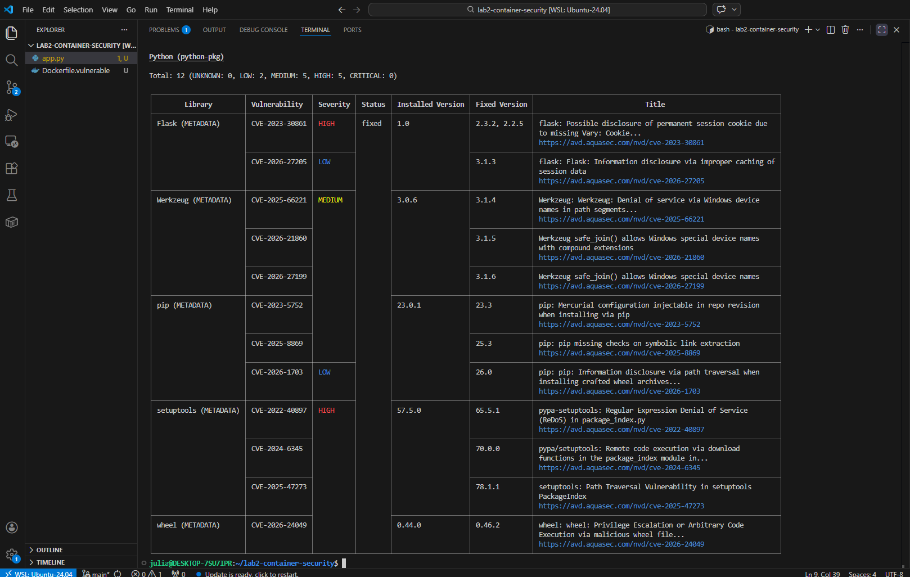
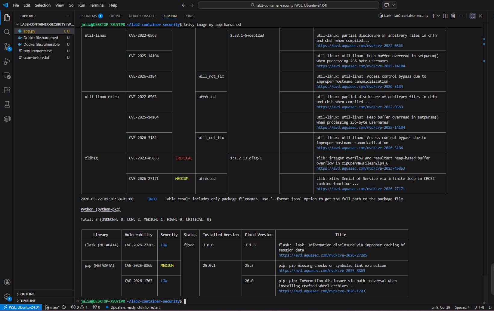
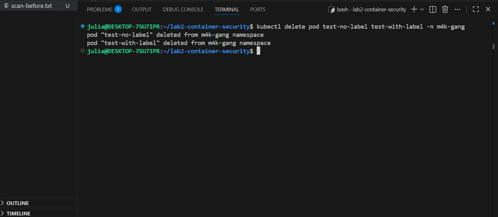

# Lab2 Container Security

## Vad projektet gör
I den här labben har jag jobbat med container-säkerhet. Jag byggde först en
medvetet osäker Docker-image för att se hur många sårbarheter den innehöll,
och sedan härdade jag den för att minska riskerna. Jag använde Trivy för att
skanna imagesen, skapade en SBOM för att dokumentera vad som finns i imagen,
och testade säkerhetspolicies i Kubernetes med OPA Gatekeeper.

## Dockerfile – Sårbar vs Härdad

### Dockerfile.vulnerable
Den sårbara imagen använder python:3.8 och flask==1.0.0 som är gamla versioner
med kända säkerhetsproblem. Den kör också som root, vilket är en onödig risk.

### Dockerfile.hardened
Den härdade imagen använder python:3.12-slim-bookworm som är både nyare och
mindre. Den kör som en egen användare istället för root, installerar bara det
som behövs, och har en healthcheck som kollar att appen faktiskt fungerar.

## Trivy-scan – Före och Efter

### Före härdning
Trivy hittade 12 sårbarheter i den sårbara imagen, varav 5 var HIGH.

### Efter härdning
Efter härdningen hade antalet sårbarheter minskat kraftigt och inga HIGH
hittades i Python-paketen. Imagen krympte också från 1.46GB till bara 206MB.

## SBOM
Jag genererade en SBOM (Software Bill of Materials) med Trivy i CycloneDX-format.
Den finns sparad i sbom.json och fungerar som en ingredienslista över allt som
finns i den härdade imagen. Det gör det enkelt att kolla om en specifik
komponent påverkas om en ny sårbarhet dyker upp.

## OPA Gatekeeper
Jag testade OPA Gatekeeper-policies i namespacet m4k-gang. Policies kontrollerar
saker som att pods har rätt labels, inte kör som root, och inte använder
:latest-taggen. När jag testade att skapa en pod utan labels fick jag varningar
från Gatekeeper direkt.

## Reflektion

Innan den här labben tänkte jag inte så mycket på vilken version av en basimage
man använder, men det visade sig ha stor betydelse för säkerheten. Bara genom
att byta från python:3.8 till python:3.12-slim gick antalet sårbarheter ner
drastiskt.

Jag lärde mig också att det är viktigt att inte köra containers som root. Det
känns som en liten detalj men om någon tar sig in i containern har de direkt
full behörighet om den kör som root.

SBOM är något jag inte visste vad det var innan, men det är ganska logiskt —
det är en lista på allt som finns i din image. Om det dyker upp en ny sårbarhet
i ett bibliotek kan man snabbt kolla om man använder det istället för att gissa.

Gatekeeper kändes lite krångligt i början men jag förstår poängen. Istället för
att hoppas att alla i teamet följer reglerna sätter man upp automatiska
kontroller som varnar eller blockerar om något inte stämmer. Det är ett smartare
sätt att jobba när man är flera personer som deployar saker till samma kluster.